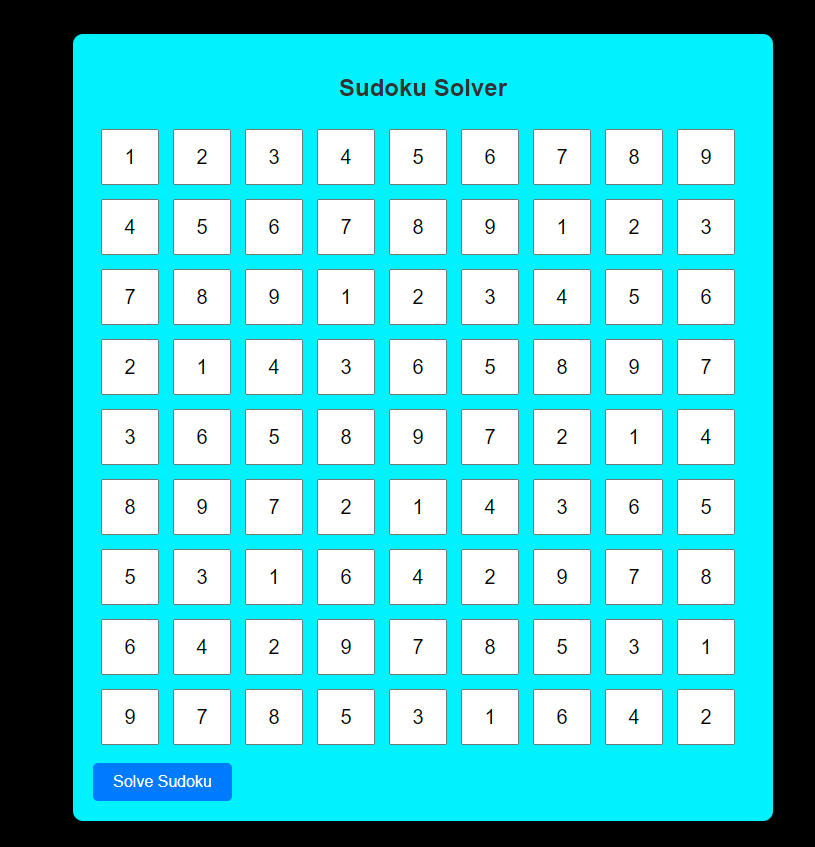

# Sudoku Solver

This is a simple Sudoku solver web application built using HTML, CSS, and JavaScript. Users can input a Sudoku puzzle and click a button to solve it. If a solution exists, it will be displayed in the input cells.

## Features

- Allows users to input Sudoku puzzles.
- Validates user input to ensure it is a valid Sudoku puzzle.
- Solves the Sudoku puzzle using a backtracking algorithm.
- Displays the solution in the input cells if one exists.
- Provides feedback to the user if no solution is found.

## Usage

1. Open the `sudoku.html` file in your web browser.
2. Input the initial Sudoku puzzle configuration into the grid.
3. Click the "Solve Sudoku" button to solve the puzzle.
4. If a solution exists, it will be displayed in the input cells. If not, an alert will notify the user.

## Files

- `sudoku.html`: HTML file containing the Sudoku solver interface.

## Contributing

Contributions are welcome! If you find any bugs or have suggestions for improvements, please open an issue or submit a pull request.

## License

This project is licensed under the MIT License - see the [LICENSE](LICENSE) file for details.
